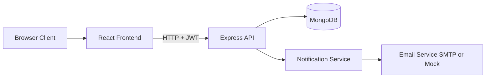

# Patient Appointment Scheduling Portal

Full-stack appointment platform with role-based access:
- Patients browse approved doctors and manage bookings.
- Doctors manage availability and appointment status.
- Admins approve doctor accounts and monitor platform activity.

## 1. System Design

### Architecture Style
- Frontend: SPA (React + Vite + Tailwind)
- Backend: REST API (Node.js + Express, MVC structure)
- Database: MongoDB (Mongoose models)
- Auth: JWT with role-based middleware

### High-Level Component View


### Request Flow
1. User authenticates via `/api/auth/*`.
2. Frontend stores JWT and sends `Authorization: Bearer <token>` on API calls.
3. Backend validates token in `protect` middleware.
4. Backend enforces role rules with `authorize(...)` middleware.
5. Controllers execute business logic and persist data via Mongoose models.

## 2. Project Structure

```text
data_engineering_project/
  backend/
    src/
      config/         # DB connection
      controllers/    # Business logic by domain
      middlewares/    # Auth, validation, error handling
      models/         # Mongoose schemas
      routes/         # REST route modules
      scripts/        # Seed utilities
      services/       # Notification + email services
      utils/          # Shared helpers
      server.js       # App bootstrap
  frontend/
    src/
      api/            # Axios client
      components/     # Shared UI and route guards
      context/        # Auth context
      layouts/        # Layout shell
      pages/          # Screens by feature/role
      utils/          # UI helpers
```

## 3. Data Model

### User
- `name`, `email`, `password`, `role`, `isApproved`
- Roles: `patient`, `doctor`, `admin`
- Password hashing handled with a pre-save hook (`bcryptjs`).
- `isApproved` defaults to `false` only for doctors.

### DoctorProfile
- One-to-one with doctor user (`doctor` unique ref)
- `specialization`, `bio`, `experienceYears`
- `availability`: array of `{ dayOfWeek: 0..6, slots: string[] }`

### Appointment
- `patient`, `doctor`, `date`, `timeSlot`, `status`, `reason`
- Status values: `pending`, `confirmed`, `rejected`, `cancelled`, `completed`
- Includes `bookedAt` and `updatedAtStatus`
- Double-booking protection uses a unique partial index on:
  - `{ doctor, date, timeSlot }`
  - applied only when status is `pending` or `confirmed`

### Notification
- `user`, `title`, `message`, `isRead`, `type`
- Types: `booking`, `status`, `admin`

## 4. Core Business Flows

### Doctor Onboarding and Approval
1. Doctor registers via auth API.
2. User is created with role `doctor` and `isApproved=false`.
3. Admin reviews doctors and updates approval status.
4. Unapproved doctors cannot log in.

### Appointment Booking
1. Patient selects doctor, date, slot.
2. Backend verifies doctor exists and is approved.
3. Backend validates slot against doctor availability for that weekday.
4. Appointment is created with `pending` status.
5. Doctor receives notification (and email if SMTP configured).
6. If slot is already taken, API returns `409` conflict.

### Appointment Lifecycle
- Patient can cancel/reschedule unless appointment is already `completed` or `cancelled`.
- Doctor can set status to `confirmed`, `rejected`, or `completed`.
- Status changes trigger patient notifications.

## 5. API Design Summary

Base URL: `http://localhost:5000/api`

### Health
- `GET /health`

### Auth
- `POST /auth/register`
- `POST /auth/login`
- `GET /auth/me` (protected)

### Patient
- `GET /patient/public/doctors` (public directory)
- `GET /patient/doctors` (patient only)
- `GET /patient/doctors/:doctorId` (patient only)

### Appointments (patient only)
- `POST /appointments`
- `GET /appointments/my`
- `PATCH /appointments/:appointmentId/cancel`
- `PATCH /appointments/:appointmentId/reschedule`

### Doctor (doctor only)
- `PUT /doctor/availability`
- `GET /doctor/appointments`
- `PATCH /doctor/appointments/:appointmentId/status`
- `GET /doctor/schedule?date=YYYY-MM-DD`

### Admin (admin only)
- `GET /admin/users`
- `GET /admin/doctors`
- `GET /admin/appointments`
- `PATCH /admin/doctors/:doctorId/approval`

### Notifications (authenticated)
- `GET /notifications`
- `PATCH /notifications/:notificationId/read`

## 6. Frontend Design

- Routing is handled in `App.jsx` with role-protected routes.
- `AuthContext` manages login state and session bootstrap from stored token.
- Axios client centralizes API base URL and auth header injection.
- Dashboards are separated by role: patient, doctor, admin.

## 7. Local Setup

### Prerequisites
- Node.js 18+
- MongoDB instance (local or Atlas)

### Backend
```bash
cd backend
npm install
copy .env.example .env
npm run dev
```

Optional seed scripts:
```bash
npm run seed:admin
npm run seed:doctors
```

### Frontend
```bash
cd frontend
npm install
copy .env.example .env
npm run dev
```

Frontend default URL: `http://localhost:5173`

## 8. Configuration

Backend `.env` keys:
- `PORT`
- `MONGODB_URI`
- `JWT_SECRET`
- `JWT_EXPIRES_IN`
- `CLIENT_URL`
- `MAIL_HOST`, `MAIL_PORT`, `MAIL_USER`, `MAIL_PASS`, `MAIL_FROM` (optional for real email)
- `ADMIN_NAME`, `ADMIN_EMAIL`, `ADMIN_PASSWORD` (used by seed script)

Frontend `.env` keys:
- `VITE_API_BASE_URL`

## 9. Run Scripts

Backend:
- `npm run dev` - start API with nodemon
- `npm start` - start API with node
- `npm run seed:admin` - create admin user
- `npm run seed:doctors` - create sample doctors

Frontend:
- `npm run dev` - start Vite dev server
- `npm run build` - production build
- `npm run preview` - preview build

## 10. Security Notes

- Do not commit real credentials in `.env` or `.env.example`.
- Rotate any secrets that were previously exposed.
- Use a strong `JWT_SECRET` and environment-specific config for deployment.
